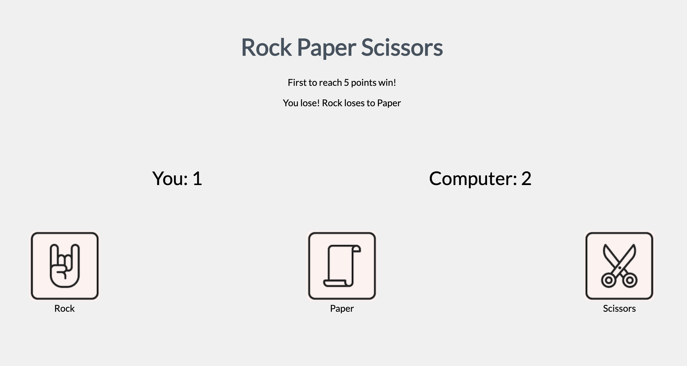

# rock-paper-scissors

My attempt at creating an online Rock Paper Scissors game, for the Odin Project.

## Credits

Images taken from: [Rock Paper Scissors Vectors by Vecteezy](https://www.vecteezy.com/free-vector/rock-paper-scissors)

## Development Progress

- First milestone: create a console Rock Paper Scissors game. (Completed in Dec 2020)
- Second milestone: give it simple UI. (Completed in Dec 2020)
- Third milestone: Revamp the UI using CSS and added graphics. (Completed in June 2020)

## Reflections

Through this project, I have the opportunity to showcase my Javascript skills. I also learnt how to manipulate the DOM via Javascript and learnt about handling events.

I took some time in June to give this game a better looking UI. While doing so, I learnt about image sprites and used one to provide the image to the action buttons in this game.

I used [Sprite Cow](http://www.spritecow.com/) to help me in generating CSS code for the image sprites.

## Future improvements

Here are some improvements I think could be made:

* ~~Improve the UI by adding a style.css file~~
* ~~Adding more graphics to the UI~~
* Using a framework like JQuery for DOM manipulation
